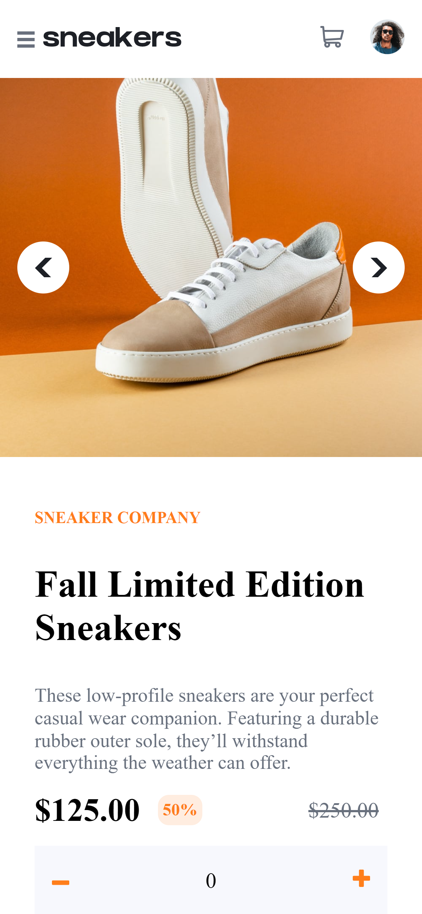
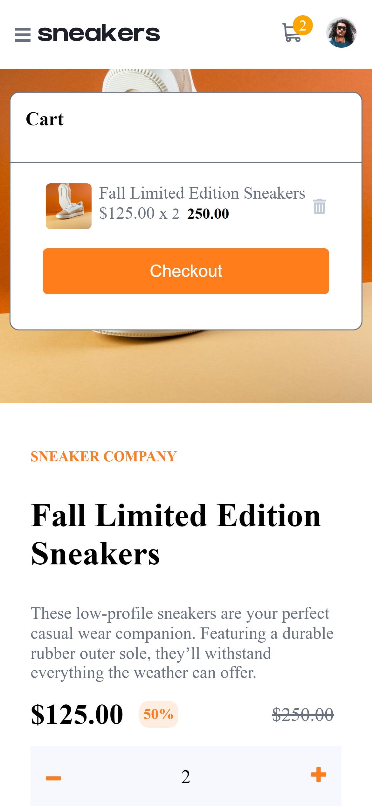
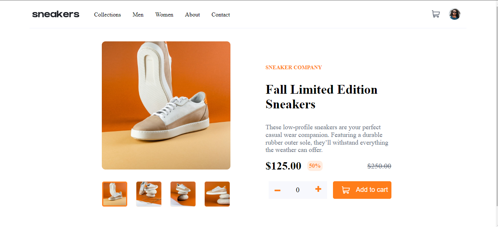

# Frontend Mentor - E-commerce product page solution

This is a solution to the [E-commerce product page challenge on Frontend Mentor](https://www.frontendmentor.io/challenges/ecommerce-product-page-UPsZ9MJp6). Frontend Mentor challenges help you improve your coding skills by building realistic projects.

## Table of contents

- [Overview](#overview)
  - [The challenge](#the-challenge)
  - [Screenshot](#screenshot)
  - [Links](#links)
- [My process](#my-process)
  - [Built with](#built-with)
  - [What I learned](#what-i-learned)
  - [Continued development](#continued-development)
  - [Useful resources](#useful-resources)
- [Author](#author)
- [Acknowledgments](#acknowledgments)

**Note: Delete this note and update the table of contents based on what sections you keep.**

## Overview
This was an intermediate javascript challenge, and will put our JS skills to the test
It took me 24 hours from start to finish.

### The challenge

Users should be able to:

- View the optimal layout for the site depending on their device's screen size
- See hover states for all interactive elements on the page
- Open a lightbox gallery by clicking on the large product image
- Switch the large product image by clicking on the small thumbnail images
- Add items to the cart
- View the cart and remove items from it

### Screenshot





### Links

- Solution URL: [Guthub Repo](https://munyite001.github.io/Ecommerce-Product-Page-with-Shopping-Cart/)
- Live Site URL: [https://ecommerce-product-page-main-fr.netlify.app/](https://ecommerce-product-page-main-fr.netlify.app/)

## My process
As always, I start any project with analysyis of the design, identifying thr different aspects that both the mobile and desktop designs have.
Then I start off with the mobile design, laying the structure with HTML then applying the styling. 
After I am comfortable with the mobile design, I will then move on to add the media breakpoints for the bigger screens.
Later on, I will start working on the site's functionality with Javascript

### Built with

- Semantic HTML5 markup
- CSS custom properties
- Flexbox
- Mobile-first workflow

### What I learned

I have learned a lot from this project, first thing being, it takes time to master web design and development. Looking at where I started, and comparing with where I am currently, I have come a long way, which is simply pushing me to go even further.

Secondly, I have learned how to manipulate elemnt attributes, with JS. For example, in the mobile design, adding the functionality of the arrows, which when clicked would change the image of that main section.
```js
arrowIcons.forEach((icon) => {
  icon.addEventListener("click", (e) => {
    let mainImage = icon.parentElement.parentElement.parentElement.querySelector('.main-product-image');
    if (e.currentTarget.classList.contains("prev")) {
      if (i > 0) {
        i -= 1;
      } else {
        i = n - 1;
      }
      mainImage.src = `${productImages[i]}`;
    } else {
      if (i < n - 1) {
        i += 1;
      } else {
        i = 0;
      }
      mainImage.src = `${productImages[i]}`;
    }
  });
```

### Continued development

I will continue working on the design, to improve it's responsiveness on more media screens.
I will also try to add more functionality, for example, right now, the cart can only be opened and closed by clicking at the cart icon. I want to improve on it, by adding a background overlay, that will allow the cart to be closed by simply clicking anywhere on the screen

## Author

- Github - [munyite001](https://www.github.com/munyite001)
- Frontend Mentor - [@munyite001](https://www.frontendmentor.io/profile/munyite001)
- Twitter - [@emunyite](https://www.twitter.com/emunyite)